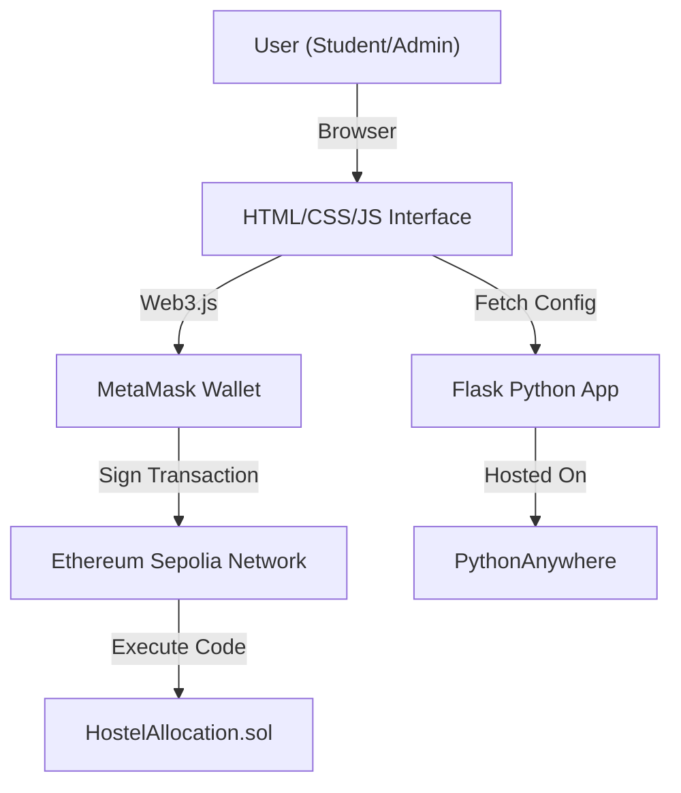

# 🏢 Hostel Room Allocation System: Project Overview

**Institution:** National Institute of Electronics & Information Technology, Ropar

**Project Type:** Blockchain DApp (Decentralized Application)

**Network:** Ethereum Sepolia Testnet

---

## 📖 1. Project Abstract

This project is a decentralized application (DApp) designed to automate the allocation of hostel rooms. Built on the **Ethereum Blockchain**, it eliminates the need for manual record-keeping by using **Smart Contracts** to handle room availability and fee payments securely.

**Core Functionality:**

* **Admins** can add rooms to the blockchain.
* **Students** can view available rooms and book them by paying ETH.
* **Transparency:** All transactions are immutable and verifiable on Etherscan.

---

## 🏗️ 2. System Architecture

The system connects a standard web frontend to the Ethereum blockchain via Web3.js.

---

## 🛠️ 3. Technology Stack

| Layer | Technology | Purpose |
| --- | --- | --- |
| **Blockchain** | Solidity ^0.8.20 | Writing the Smart Contract logic. |
| **Network** | Sepolia Testnet | Testing environment for free ETH transactions. |
| **Wallet** | MetaMask | Browser extension to sign transactions. |
| **Backend** | Python Flask | Serving the web app and configuration. |
| **Frontend** | HTML5, CSS3, JS | User interface for Admins and Students. |
| **Hosting** | PythonAnywhere | Live deployment of the web application. |

---

## 🚀 4. Step-by-Step Implementation Guide

Follow these phases to set up, deploy, and test the system.

### 📍 Phase 1: Wallet & Network Setup

**Goal:** Prepare your browser to interact with the Blockchain.

1. **Install MetaMask:** Download the extension from [metamask.io](https://metamask.io).
2. **Create Two Accounts:**
* **Account 1:** Name it "College Admin"
* **Account 2:** Name it "Student"

3. **Add Sepolia Network:** If not visible, add it manually via Settings > Networks.

#### 📸 Screenshot: MetaMask Installation

#### 📸 Screenshot: Configuring Sepolia Network

---

### 📍 Phase 2: Funding Your Wallet (Faucets)

**Goal:** Get free "Test ETH" to pay for gas fees. You cannot run the app without this.

1. Visit a faucet (e.g., [Google Web3 Faucet](https://cloud.google.com/application/web3/faucet/ethereum/sepolia) or [Sepolia PoW Faucet](https://sepolia-faucet.pk910.de/)).
2. Enter your **College Admin** address and request funds.
3. Repeat for your **Student** address.

#### 📸 Screenshot: Faucet Interfaces

#### 📸 Screenshot: Successful Funding Verification

---

### 📍 Phase 3: Smart Contract Deployment

**Goal:** Upload the `HostelAllocation.sol` code to the Blockchain using Remix IDE.

1. Open [Remix IDE](https://remix.ethereum.org).
2. Create a new file `HostelAllocation.sol` and paste the code.
3. Compile using version `0.8.20`.
4. **Deploy:**
* Environment: Select **Injected Provider - MetaMask**.
* Make sure you are on the **College Admin** account.
* Click **Deploy**.

5. **Copy Address:** Copy the deployed contract address (starts with `0x...`) for the next phase.

#### 📸 Screenshot: Remix IDE - Creating the File

#### 📸 Screenshot: Compiling the Code

#### 📸 Screenshot: Selecting Injected Provider (MetaMask)

#### 📸 Screenshot: Deployment Transaction

#### 📸 Screenshot: Copying the Contract Address

---

### 📍 Phase 4: Local Application Setup

**Goal:** Connect the Python Flask frontend to your deployed contract.

1. Update `app.py`: Replace `contractAddress` with the address you copied from Remix.
2. Install requirements: `pip install -r requirements.txt`.
3. Run the app: `python app.py`.
4. Open `http://127.0.0.1:5000` in your browser.

#### 📸 Screenshot: Application Running Locally

---

### 📍 Phase 5: Testing the Workflow

#### A. Admin Workflow (College Account)

Only the wallet that deployed the contract can see the "Add Room" panel.

1. Connect Wallet -> Select "College Admin".
2. Enter Fee (e.g., 0.01 ETH) -> Click **Add Room**.
3. Confirm transaction in MetaMask.

**📸 Screenshot: Admin Dashboard (Authorized View)**

**📸 Screenshot: Admin Adding a Room**

**📸 Screenshot: Room Successfully Listed**

---

#### B. Student Workflow (Public Account)

Any other wallet connects as a Student. They cannot add rooms; they can only apply.

1. Switch MetaMask to "Student Account".
2. Refresh page -> Admin panel disappears.
3. Click **Apply for Room**.
4. Pay the fee via MetaMask.

**📸 Screenshot: Student Dashboard (Restricted View)**

**📸 Screenshot: Student Applying for Room**

**📸 Screenshot: Successful Allocation**

---

### 📍 Phase 6: Live Deployment (PythonAnywhere)

**Goal:** Host the application on the public internet.

1. Upload project files to PythonAnywhere.
2. Install dependencies in the Bash console.
3. Configure WSGI file to point to your `app.py`.
4. Disable CORS in `app.py` (as per code comments).
5. Reload the web app.

#### 📸 Screenshot: Live Site on PythonAnywhere

---

## 🔍 5. Blockchain Verification

Every action taken in the app is permanently recorded on the blockchain. You can verify this using the Etherscan Block Explorer.

**What to look for:**

* **Contract Creation:** The first transaction deploying the code.
* **Method `addRoom`:** Transactions where Admin added inventory.
* **Method `applyForRoom`:** Transactions where Students paid fees.

#### 📸 Screenshot: Etherscan Transaction Log

---

## 🔮 6. Future Enhancements

To further improve this system, the following features are proposed:

1. **Refund System:** Allow students to cancel bookings and receive partial refunds.
2. **Room Categories:** Distinguish between AC and Non-AC rooms with different fees.
3. **Waitlists:** Allow students to queue for fully booked rooms.
4. **Token Rewards:** Issue utility tokens to students for timely payments.

---

## 📜 7. License & Credits

**Developed By:** Dr. Sarwan Singh
**Institution:** National Institute of Electronics & Information Technology, Ropar
**License:** MIT License
**Date:** January 2026
