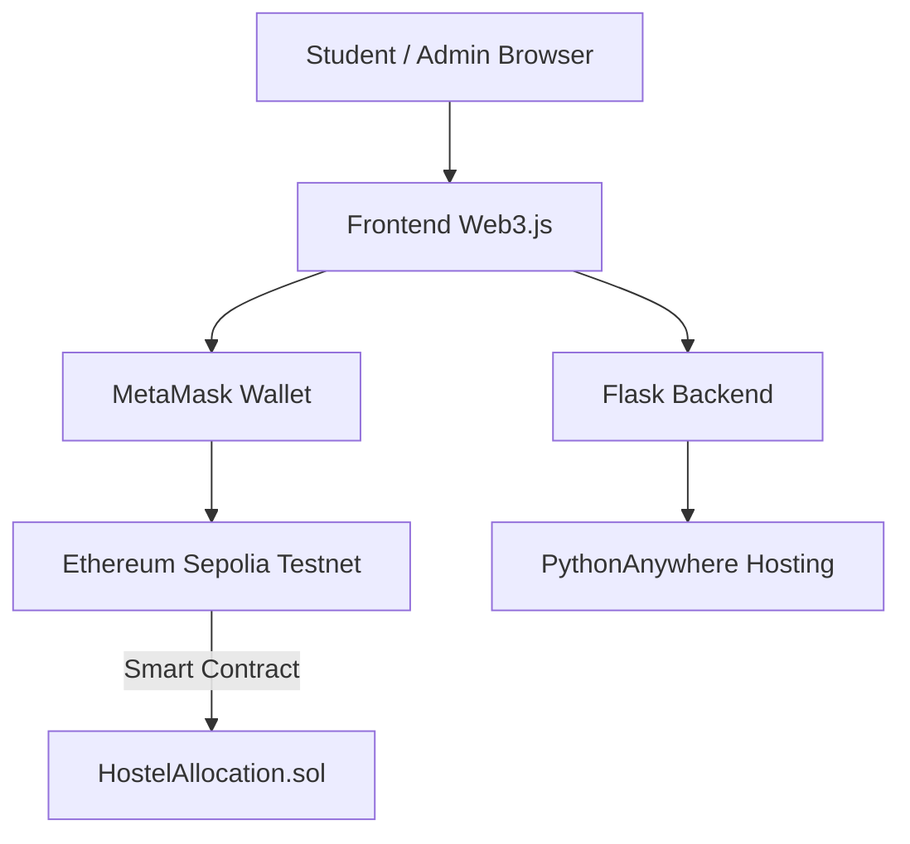

# Hostel Room Allocation System — Overview

This document provides a complete overview of the Blockchain-based Hostel Room Allocation System, including setup, deployment, testing, verification, and screenshot placeholders to support academic documentation and project submissions.

---

## 1. Project Description

The Hostel Room Allocation System is a decentralized application (DApp) built on the Ethereum blockchain. It enables an administrator to add hostel rooms and students to apply and pay room fees using cryptocurrency on the Sepolia Test Network. The frontend uses MetaMask for wallet authentication, and blockchain operations are conducted via smart contracts written in Solidity.

---

## 2. Key Features

* MetaMask wallet authentication
* Blockchain-based fee payment
* Admin-controlled room creation
* Student room application workflow
* On-chain verification via Etherscan
* Deployment on PythonAnywhere

---

## 3. Architecture Overview



---

## 4. Technology Stack

**Blockchain Layer**

* Ethereum Sepolia
* Solidity ^0.8.20
* MetaMask
* Web3.js

**Backend Layer**

* Python 3.x
* Flask 3.0
* Flask‑CORS

**Frontend Layer**

* HTML / CSS / JS

**Deployment**

* PythonAnywhere

---

## 5. System Requirements

| Requirement    | Description                |
| -------------- | -------------------------- |
| Wallet         | MetaMask Browser Extension |
| Test ETH       | Sepolia ETH Faucet         |
| Python Version | Python 3.7+                |
| Hosting        | PythonAnywhere (Free)      |
| IDE            | VS Code / Sublime / Any    |

---

## 6. Blockchain Setup Steps

### 6.1 MetaMask Installation

1. Install MetaMask from metamask.io
2. Create wallet
3. Secure secret recovery phrase

**Screenshot:**

```


```

---

### 6.2 Add Sepolia Network

Configure network:

```
Network: Sepolia Test Network
RPC: https://sepolia.infura.io/v3/
ChainID: 11155111
Symbol: SepoliaETH
Block Explorer: https://sepolia.etherscan.io
```

**Screenshot:**

```


```

---

### 6.3 Faucet Funding

Use recommended faucet:


* [https://sepolia-faucet.pk910.de/](https://sepolia-faucet.pk910.de/)

* [https://cloud.google.com/application/web3/faucet/ethereum/sepolia](https://cloud.google.com/application/web3/faucet/ethereum/sepolia)


Fund **College** and **Student** accounts.

**Screenshot:**

```


```

---

### 6.4 Smart Contract Deployment

Steps using Remix IDE:

1. Open remix.ethereum.org
2. Create `HostelAllocation.sol`
3. Compile using v0.8.20
4. Deploy using Injected Provider (MetaMask)
5. Save contract address

**Screenshot Placeholders:**

```


```

---

## 7. Local Development Setup

### Project Structure

```
hostel-blockchain-system/
├── app.py
├── requirements.txt
├── HostelAllocation.sol
├── templates/
│   └── index.html
├── static/
│   ├── style.css
│   └── app.js
└── README.md
```

### Running Locally

```
pip install -r requirements.txt
python app.py
```

Open: `http://127.0.0.1:5000`

**Screenshot:**

```

```

---

## 8. Deployment on PythonAnywhere

### 8.1 File Upload

Upload via File Browser into:

```
/home/<username>/hostel-blockchain-system
```

### 8.2 Install Dependencies

```
pip3 install --user -r requirements.txt
```

### 8.3 WSGI Configuration

Set WSGI file to:

```python
project_home='/home/<username>/hostel-blockchain-system'
sys.path.insert(0, project_home)
from app import app as application
```

### 8.4 Static Mapping

```
URL: /static/
Dir: /home/<username>/hostel-blockchain-system/static/
```

### 8.5 Reload Web App

Open final application:

```
https://<username>.pythonanywhere.com
```

**Screenshot:**

```

```

---

## 9. Application Workflow Testing

### 9.1 Admin Flow

1. Connect MetaMask
2. Select College account
3. Add Room (fee in ETH)

**Screenshot Placeholders:**

```


```

---

### 9.2 Student Flow

1. Switch MetaMask to Student account
2. Apply for Room
3. Confirm blockchain payment
4. Allocation visible

**Screenshot:**

```


```

---

## 10. Blockchain Verification

Verify on Etherscan:

* Contract creation
* addRoom()
* applyForRoom()

**Screenshot:**

```

```

---

## 11. Academic Reporting Sections

Includes:

* Abstract
* Introduction
* Literature Review
* System Design
* Implementation
* Testing
* Results
* Conclusion
* References

---

## 12. Future Enhancements

* Refund workflows
* Room category management
* Analytics dashboard
* Notification system
* Token reward scheme

---

## 13. Final Deliverables Summary

| Deliverable               | Status      |
| ------------------------- | ----------- |
| Smart Contract            | Completed   |
| DApp Frontend             | Completed   |
| Flask Backend             | Completed   |
| PythonAnywhere Deployment | Completed   |
| Blockchain Verification   | Completed   |
| Academic Documentation    | In Progress |
| Screenshot Placeholders   | Completed   |

---

## 14. Last Updated

20 January 2026
